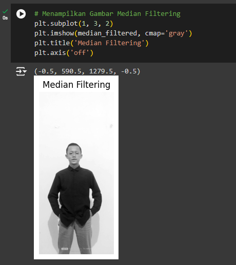

# Project UAS Pengolahan Citra Digital

## Bukti Gambar

## Teori Yang Mendukung
## * Median Filtering

1. Robustness terhadap Noise : Median filtering sangat efektif untuk menghilangkan noise tipe impulsif (seperti salt-and-pepper noise) karena median adalah statistik yang robust dan tidak terpengaruh oleh outlier.
2. Preservasi Tepi : Tidak seperti mean filtering, median filtering tidak memperhalus tepi yang tajam dalam gambar, sehingga mempertahankan detail penting dalam gambar.

## * Mean Filtering
1. Reduksi Noise Gaussian : Mean filtering efektif dalam mengurangi noise Gaussian yang tersebar secara acak dan seragam dalam gambar.
2. Teori Konvolusi : Mean filtering dapat dianggap sebagai konvolusi gambar dengan kernel berukuran N x N yang memiliki semua elemen dengan nilai yang sama, yaitu 1/N^2

## Rincian/Tahapan cara menyelesaikan

### 1. Mengimpor Pustaka

- cv2 : OpenCV library yang digunakan untuk pemrosesan citra.
- numpy : Library untuk operasi numerik.
- matplotlib.pyplot : Library untuk visualisasi citra.

### 2. Memuat Gambar

- image_path : Jalur ke file gambar yang akan diproses. Pastikan untuk menggantinya dengan jalur gambar yang sesuai.
- cv2.imread : Fungsi untuk membaca gambar dari file. Parameter cv2.IMREAD_GRAYSCALE digunakan untuk membaca gambar dalam mode grayscale (hitam putih).

### 3. Menampilkan Original Image

- plt.figure(figsize=(15, 5)) : Membuat figur baru dengan ukuran 15x5 inci.
- plt.subplot(1, 3, 1) : Menambahkan subplot pertama dari total 3 subplot dalam satu baris.
- plt.imshow(image, cmap='gray') : Menampilkan gambar asli dalam mode grayscale.
- plt.title('Original Image') : Memberikan judul pada subplot.
- plt.axis('off') : Menonaktifkan sumbu agar tidak ditampilkan.

### 4. Menerapkan Median Filtering Menggunakan OpenCV

- cv2.medianBlur(image, 5) : Menerapkan median filtering dengan ukuran kernel 5x5 pada gambar asli.

### 5. Menampilkan Gambar  Median Filtering

- plt.subplot(1, 3, 2) : Menambahkan subplot kedua dari total 3 subplot dalam satu baris.
- plt.imshow(median_filtered, cmap='gray') : Menampilkan gambar yang telah difilter menggunakan median filter.
- plt.title('Median Filtering') : Memberikan judul pada subplot.
- plt.axis('off') : Menonaktifkan sumbu agar tidak ditampilkan.

### 6. Menerapkan Mean Filtering secara Manual

- manual_mean_filtering(image, kernel_size=5) : Fungsi untuk menerapkan mean filtering secara manual.
- pad_size = kernel_size // 2 : Menghitung ukuran padding berdasarkan ukuran kernel.
- padded_image = np.pad(image, pad_size, mode='constant', constant_values=0) : Menambahkan padding pada gambar asli untuk menghindari masalah pada tepi gambar.
- mean_filtered = np.zeros_like(image) : Membuat array baru dengan ukuran yang sama dengan gambar asli untuk menyimpan hasil mean filtering.
- for i in range(pad_size, padded_image.shape[0] - pad_size) : Loop untuk melewati setiap baris gambar.
- for j in range(pad_size, padded_image.shape[1] - pad_size) : Loop untuk melewati setiap kolom gambar.
- window = padded_image[i - pad_size + pad_size + 1, j - pad_size + pad_size + 1] : Mengambil jendela (window) ukuran kernel dari gambar yang telah dipadding.
- mean_filtered[i - pad_size, j - pad_size] = np.mean(window) : Menghitung rata-rata nilai piksel dalam jendela dan menetapkan nilai ini ke piksel tengah jendela pada hasil gambar mean filtered.

### 7. Menerapkan Mean Filtering dan Menampilkan Hasilnya

- mean_filtered = manual_mean_filtering(image, kernel_size=5) : Menerapkan mean filtering secara manual dengan ukuran kernel 5x5.
- plt.subplot(1, 3, 3) : Menambahkan subplot ketiga dari total 3 subplot dalam satu baris.
- plt.imshow(mean_filtered, cmap='gray'): Menampilkan gambar yang telah difilter menggunakan mean filter.
- plt.title('Mean Filtering'): Memberikan judul pada subplot.
- plt.axis('off') : Menonaktifkan sumbu agar tidak ditampilkan.
- plt.show() : Menampilkan semua subplot dalam satu figur.

